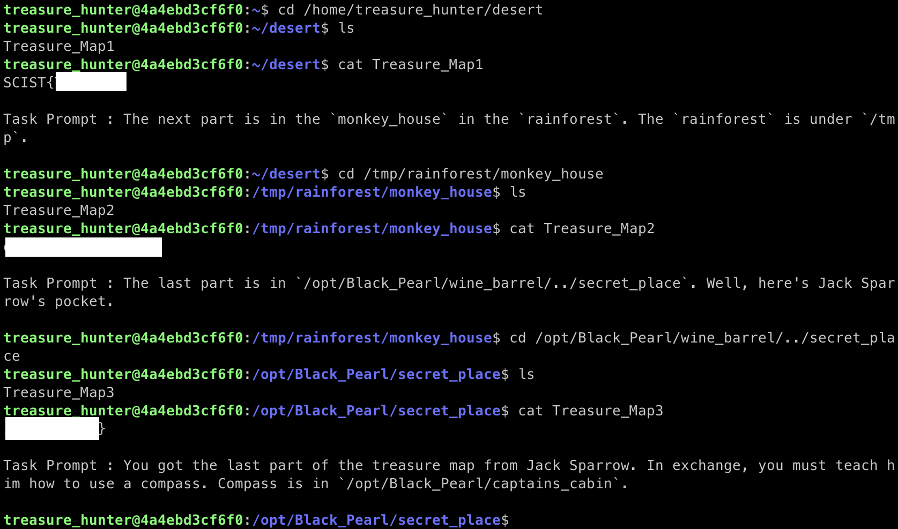

# SCIST Linux Challenge RPG Writeup

這篇會寫所有 SCIST Linux Challenge RPG 挑戰的 Writeup，如果想要知道怎麼使用 SCIST Linux Challenge RPG 或想要自己 build Image，可以到 [這裡](/blog/scist_linux_challenge_rpg_blog/) 去看。

## 前情提要
SCIST Linux Challenge RPG 我主要是想說弄一個類似 RPG 的遊戲，讓做題目可以更有趣，所以說花了蠻多時間在想劇情跟怎麼把題目融合進去。如果有興趣的話可以先不看 CTFd 的題敘，仔細從開啟挑戰開始喔～


---
## Treasure Hunt
### 1. Welcome
開啟挑戰之後可以看到以下畫面，而這些資訊裡就有這題的 flag


### 2. ls & cat
從題目敘述可以知道好像有一個怪怪的檔案，那既然要找怪怪的檔案，所以就先用 `ls` 看看有哪些檔案


可以看到有一個叫 `SCIST{I_am_really_nor` 的檔案，用 `cat` 把這個檔案開起來看看


把檔名跟檔案內找到的合起來就找到 flag 了

> 在 `cat` 時 `{` 前面有一個反斜線，這個是為了 escape 掉 `{` 的特殊意義，讓 `{` 可以正常的被讀取

### 3. cd
從題目敘述可以知道藏寶圖被分成三個 part，分別在 `/home/treasure_hunter/desert`、`/tmp/rainforest/monkey_house`、`/opt/Black_Pearl/wine_barrel/../secret_place`。所以可以用 `cd` 移動到藏寶圖在的位址，用 `ls` 看一下檔案叫什麼，然後用 `cat` 看看檔案的內容。



把找到的三段合起來就可以得到 flag 了

### 4. file & chmod & execute
從題目敘述可以知道 `/opt/Black_Pearl/captains_cabin` 底下有 `compass`。我們先用 `cd` 移動到 `/opt/Black_Pearl/captains_cabin` 看看 `compass` 是什麼


可以看到 `compass` 是一個 ELF（Linux 底下的可執行檔），那我們就用 `chmod` 給它執行權限，然後執行它


執行後就可以得到 flag 了

### 5. hidden file
從題目標題和敘述可以知道有一個隱藏檔在 `/opt/Black_Pearl/captains_cabin`，用 `cd` 移動到目標路徑後用 `ls -a` 看看隱藏檔叫什麼


用 `cat` 看看隱藏檔的內容後就可以得到 flag 了

### 6. create & write file
從題目敘述知道有一個 `~/tools` 裡有一個 `translator`，先去看看 `translator` 是做什麼的


在知道 `translator` 是 ELF 後，直接執行可以發現 `translator` 說當前資料夾沒有 `Treasure_Map`，可以推(通)測(靈)出需要放一個檔案叫 `Treasure_Map` 在當前資料夾下，然後內容要是 `2. ls & cat` 的 flag。

首先先用 `vim Treasure_Map` 開啟一個 `vim` 編輯器，然後寫入 `2. ls & cat` 的 flag，然後按 `:wq` 存檔離開，重新執行一次 `translator`


就可以得到 flag

### 7. mkdir & mv 1
從題目敘述可以知道要在家目錄建一個資料夾叫 `Shipwreck_Ship`，然後把 `~/tools` 底下的 `magic_engine` 移到 `Shipwreck_Ship`


把 `magic_engine` 移動過去之後，發現這是一個 ELF，所以加上執行權限後執行，就可以得到 flag 了

### 8. mkdir & mv 2
從題目敘述可以知道這題需要把剛剛建立的 `Shipwreck_Ship` 改成 `Titanic`，然後再執行一次 `magic_engine`


執行後就可以得到 flag

### 9. find
從題目敘述可以知道我們需要在 `~/ocean/small_island/maze` 底下找到 flag，我們可以用 `find` 來找找看


移動到放 `flag` 的資料夾，然後把 `flag` 的內容的 `cat` 出來就解開了

### 10. unzip & rar & tar
從上一題或是題目敘述可以知道在 `~/ocean/small_island/maze/R/f/m/g/a` 底下有一個 `Tr34suR3.zip`，那就把他解壓縮看看


經過各種各樣的解壓縮，我們得到一個 `Peoples_Law_Gavel`，把它的內容印出來，就得到了 flag

---
## Side Quest : Treasure Hunter's Training
### 1. strings
這題如果直接去執行 `chal`，會發現它提示你仔細看這題的標題。如果用 `strings` 直接去看 `chal` 的可視字元，也沒有發現什麼長得像 flag。但是 `strings` 預設要 4 個連續的可視字元才會印出來，所以嘗試一下調整成只要 1 個可視字元


就可以找到 flag 了

### 2. strings & grep
這一題把 `chal` 跑起來之後發現都是一些沒用的訊息，所以嘗試用 `strings` 看看這支 binary 有沒有什麼特別的字元。但因為 `strings` 給出來的訊息太多了，所以我們可以嘗試用 `grep` 來擷取一些格式可能是 flag 的字串


我這邊利用 flag 一定會有 SCIST，所以直接用 `grep` 去過濾出有 SCIST 的字串，然後就得到 flag 了

### 3. strings & grep & regex 1
這一題把 `chal` 跑起來之後發現需要一個長 `some_char{some_char}` 這樣個字串，我們可以直接用 `strings` + `grep` 配合正則表達式來找字串


把找到的字串給 `chal` 之後就可以得到 flag 了

### 4. strings & grep & regex 2
這一題把 `chal` 跑起來之後可以嘗(通)試(靈)出選 5 可以得到一些 flag 的提示


得到提示後就可以直接使用 `grep` 和正則表達式直接找到 flag

### 5. xargs
這一題可以看到資料夾下有一個 `target_list.txt`，這下面有所有 `target` 的位置，那我們可以直接使用 `xargs` 把所有 `target` 都印出來，然後再用 `grep` 去擷取有 flag 格式的字串，就可以得到 flag 了


---
## Side Quest : Chinese Parents' Challenge
### 1. hex
這題需要把 `chal` 中的十六進位數字轉成字串，我這邊是直接使用 Python 裡面的 `bytes.fromhex` 來作轉換就可以得到 flag 了


### 2. base64
這題需要把 `chal` 中的字串做 base64 decode


直接把 `cat` 出來的結果 pipe 給 `base64 -d` 去做解碼就可以得到 flag 了

### 3. run C
這題需要把 `chal.c` 編譯成 ELF，然後再去執行它


用 `gcc` 這個指令把 `chal.c` 編譯之後，執行那個 ELF 檔，就可以得到這題的 flag 了

### 4. run Python
這題需要把 `chal.py` 跑起來


直接用 `python3` 把 `chal.py` 跑起來之後就可以得到 flag 了

---
## Side Quest : Special Identity
### 1. id & groups
從題目敘述可以知道 `treasure_hunter` 好像在一個秘密群組裡，那我們可以用 `groups` 去看看 `treasure_hunter` 在哪些群組


可以看到其中一個 `treasure_hunter` 在的群組名稱就是這一題的 flag

### 2. curl
這題需要我們去訪望 `http://web_service`，因為在 Lab 中只能用 CLI，所以可以使用 `curl` 去訪問


從訪問得到的 content 就可以拿到 flag 了

### 3. wget
在請求 `http://web_service` 的時候，我們可以發現一個功能像是登入的 form，而題目也提示密碼跟使用者所在的秘密群組名稱有關，稍微思(通)考(靈)一下就可以想到 username 會是 `treasure_hunter` 而 password 就是秘密群組的 GID


在向 `http://web_service` 發送 POST 請求之後，可以看到 server 把我們 redirect 到 `profile.php`，而且設定了一個 cookie


接著我們看到一個下載 profile 的連結，嘗試用 `wget` 下載看看


可以發現這個檔案的下載並不需要 cookie，下載下來後查看檔案內容就可以得到這題的 flag 了

### 4. ssh
這題需要我們用 ssh 連到 `ssh_service`，而且相關的資料題目都有給（或是可以從上一題的 profile 得到）


用 ssh 連進去之後可以發現有一個 `secret` 檔案，查看檔案內容就可以得到 flag 了

### 5. redirect
承接剛剛那一題，連進去之後還可以發現一個檔案叫 `red_pill`，如果去 `cat` 它的話可以發現是一串亂碼，可以猜測是 ELF，所以執行看看。執行後發現有一堆看起來都符合 flag 格式的字串，根據題目名字或是通靈可以猜測真 flag 和假 flag 分別是從不同的資料流輸出


測試之後發現真的 flag 會從 `stdout` 送出來，假的 flag 會從 `stderr` 送出來，所以只要把 `stderr` 導開那螢幕上顯示的就會只剩下 `stdout`，真的 flag 也就顯現出來了

### 6. ssh medium
承接 `4. ssh`，資料夾底下還有一個 `ssh_config` 檔案，打開來後發現是 `ssh_service` 上另一位使用者的帳號密碼，我們可以先 `exit` 對回到 `challenge_box`，然後再用 `ssh` 連到新得到帳密的使用者


用 `ssh` 連進去後可以發現有兩個檔案，如果 `cat shell.py` 可以發現這大概是當前使用者 shell 所執行的程式

```python
#!/usr/bin/env python3
import os
import string

def is_valid(cmd):
    whitelist = ['ls','cat']
    blacklist = ['!','"','#','$','%','&',"'",'(',')','+',',','-','/',';','<','=','>','@','\\','^','`','{','|','}','~']

    if not (cmd.split()[0] in whitelist):
        return False
    for char in cmd:
        if (char in string.ascii_uppercase):
            return False
        if (char in blacklist):
            return False
    return True

while True:
    cmd = input('$ ').strip()
    if cmd == 'exit':
        break
    if not is_valid(cmd):
        print("Invalid Command !")
        continue
    os.system(cmd)
```

分析這個 `shell.py` 後可以發現我們需要繞過 `is_valid` 的檢查才可以把 `MuMuMu` 的內容用 `cat` 印出來。詳細檢查 `blacklist` 之後發現 `*` 這個萬用匹配字元並沒有被 ban 掉，所以可以用 `*` 來匹配 `MuMuMu`（這邊說的匹配是指 Linux Wildcards 的匹配，詳細可以參考 [這裡](/misc/linux_wildcards/)）


用 `cat *` 讓 `*` 去匹配後可以發現 `MuMuMu` 和 `shell.py` 都被匹配到而印出來，而其中就可以找到這題的 flag

### 7. ssh advance
在 `5. redirect` 有得到的 flag 寫了一個 password，而如果用 `neo` 的帳號等入到 `ssh_service`，然後去 `/home` 底下看看有什麼使用者資料夾時


可以發現除了 `neo` 和 `morpheus` 之外多了一個使用者 `smith`，嘗試用 `smith` 和 `5. redirect` 得到的密碼登入 `ssh_service`


可以發現和上一題一樣有一個 `shell.py` 和 `S3cRe7_F1ag`，把 `shell.py` 印出來之後分析一下

```python
#!/usr/bin/env python3
import os
import string

def is_valid(cmd):
    whitelist = ['ls','cat']
    blacklist = ['!','"','#','$','%','&',"'",'(',')','*','+',',','-','/',';','<','=','>','?','@','\\','^','`','{','|','}','~']

    if not (cmd.split()[0] in whitelist):
        return False
    for char in cmd:
        if (char in string.ascii_uppercase) or (char in string.digits):
            return False
        if (char in blacklist):
            return False
    return True

while True:
    cmd = input('$ ').strip()
    if cmd == 'exit':
        break
    if not is_valid(cmd):
        print("Invalid Command !")
        continue
    os.system(cmd)
```

分析之後發現這次 `is_valid` 更為嚴格，找尋一下有什麼 Linux Wildcards 可以去匹配 `S3cRe7_F1ag`，然後去構造 payload。以下是我構造的 payload

```bash
cat [[:upper:]][[:digit:]]c[[:upper:]]e[[:digit:]]_[[:upper:]][[:digit:]]ag
```

把這段 payload 輸入後


就可以匹配到 `S3cRe7_F1ag` 然後把 flag 印出來。

到這邊整個 SCIST Linux Challenge RPG 就解完啦～ 恭喜恭喜！！！

---
## 相關連結
- CTFd：[https://linux.ctf.scist.org](https://linux.ctf.scist.org)
- Github：[https://github.com/scist-tw/SCIST_Linux_Challenge_RPG/tree/master](https://github.com/scist-tw/SCIST_Linux_Challenge_RPG/tree/master)
- Docker Hub：[https://hub.docker.com/r/curiouslucifer/scist_linux_challenge_rpg](https://hub.docker.com/r/curiouslucifer/scist_linux_challenge_rpg)

